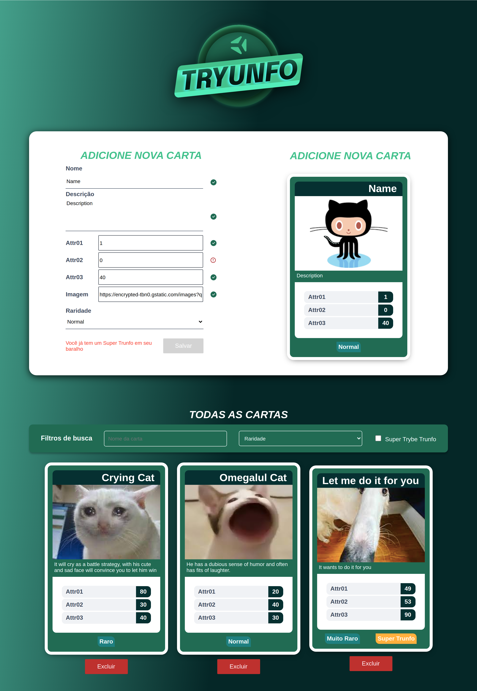

# React Deck Register

Uma aplicação de criação, busca e remoção de cartas de um baralho.

## Sobre

Essa aplicação é a resolução de um dos projetos do curso de Desenvolvimento Web 
Full-stack da Trybe feita seguindo um readme com os requisitos do projeto e um 
protótipo do figma da interface e estilização.

O objetivo era praticar conceitos do desenvolvimento react como formulários 
e os mais variados tipos de inputs controlados, estados e props do react.

## Funcionalidades

Essa aplicação contém um formulário para criação de cartas de um baralho com 
diversas validações dos campos, além de uma listagem das cartas criadas e a 
possibilidade de filtrar por nome, raridade, selo de supertrunfo e remover uma 
carta.

## Tecnologias

- ReactJS
- CSS Modules

## Melhorias

- Na época o projeto foi desenvolvido com react utilizando classes, uma boa 
melhoria seria desenvolver utilizando funções e hooks do react.
- Adicionar estilização responsiva